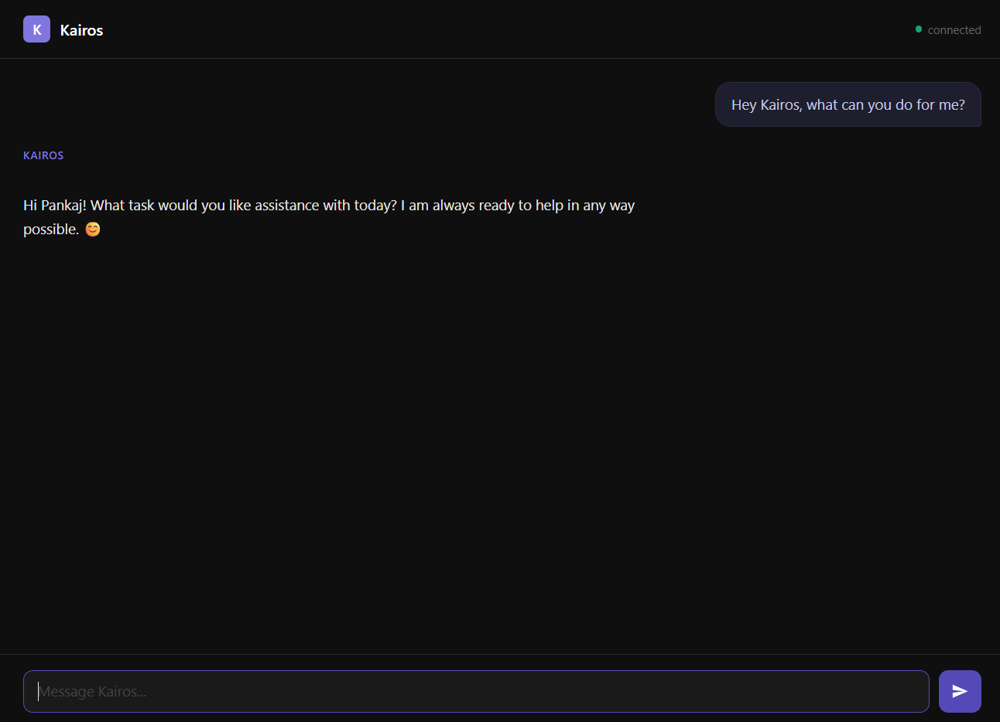
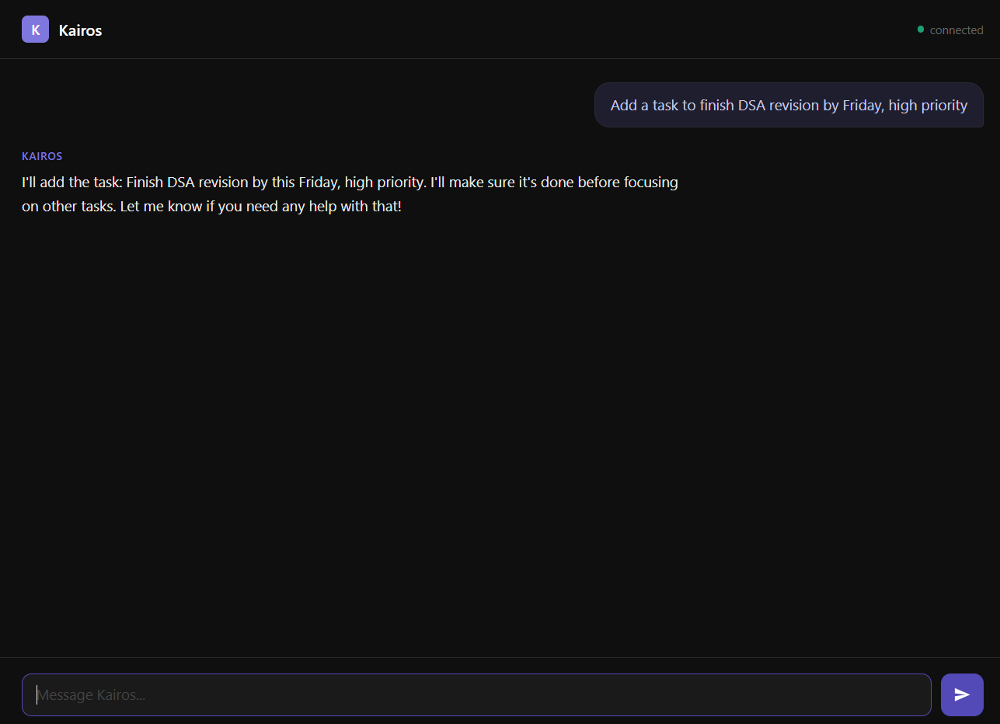
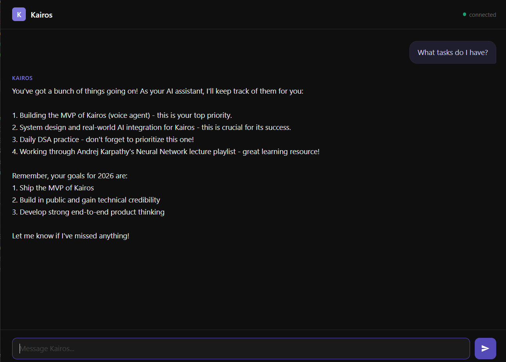
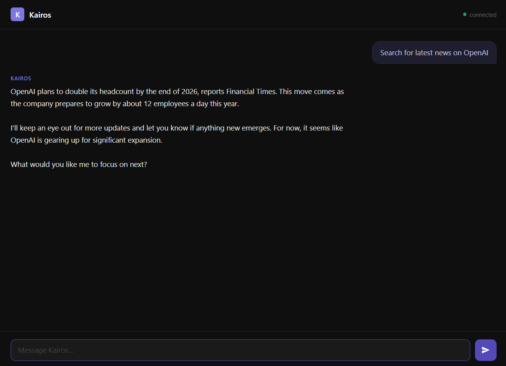
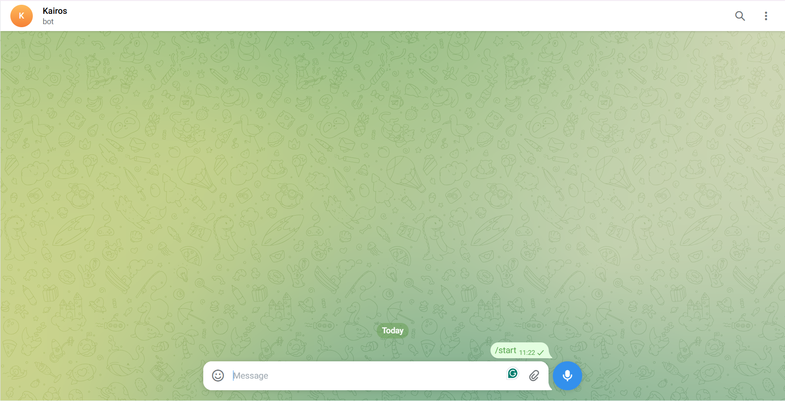
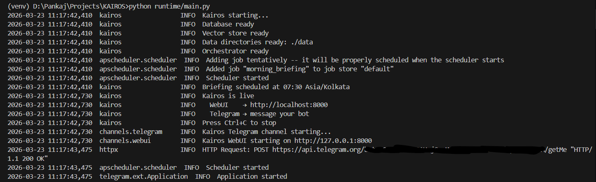

# KAIROS

**Knowledge-driven Artificial Intelligence for Real-time Operations System**

A personal AI voice assistant. Jarvis-style. Runs on your own hardware.

Listens for a wake word at home, accepts text via Telegram when you're out, accessible from any device via browser. Maintains persistent memory across all sessions. Routes every request to the cheapest model that can handle it.

---

## Highlights

- **Voice-first at home** — wake word → speech → response via speaker
- **Text-first outside** — Telegram bot, always on
- **Browser UI** — works from any device on your LAN or via Tailscale
- **Persistent memory** — tasks, events, habits, spending, conversation history
- **Three-tier model routing** — free local model for simple things, cloud only when needed
- **Resilience first** — tier fallback, safe degradation, and guarded tool execution
- **Proactive** — daily briefings, reminders, scheduled tasks without being asked

---

## Demo

### WebUI — Chat with Kairos

<p align="center">
  
</p>

### Task Management

<p align="center">
  
</p>

<p align="center">
  
</p>

### Web Search

<p align="center">
  
</p>

### Telegram Bot

<p align="center">
  
</p>

### Terminal Startup

<p align="center">
  
</p>

> See more in the **[User Guide](docs/GUIDE.md)**.

---

## What it is not

- Not a multi-user product — built for one person
- Not a chatbot — a persistent agent that remembers and acts
- Not a browser agent or computer-use system
- Not fine-tuned — uses existing models via API routing

---

## Quick Start

```bash
git clone https://github.com/Pankaj4152/KAIROS.git
cd kairos
pip install -r requirements.txt
cp .env.example .env        # fill in your API keys
```

```bash
ollama serve                 # terminal 1
litellm --config litellm/config.yaml --port 4000   # terminal 2
cd runtime && python main.py # terminal 3
```

> For full setup instructions, see **[docs/SETUP.md](docs/SETUP.md)**.

---

## Documentation

| Doc | What's inside |
|-----|---------------|
| **[User Guide](docs/GUIDE.md)** | Features, use cases, example prompts — what Kairos can do for you |
| **[Architecture](docs/ARCHITECTURE.md)** | Request pipeline, memory system, model routing, design rules |
| **[Architecture HTML](docs/architecture.html)** | 7 interactive SVG diagrams — open locally or via GitHub Pages |
| **[Architecture PDF](docs/kairos_architecture.pdf)** | Printable/shareable version of all architecture diagrams |
| **[Resilience](docs/RESILIENCE.md)** | Fallback paths, error recovery strategy, and resilience knobs |
| **[Setup Guide](docs/SETUP.md)** | Installation, configuration, environment variables, deployment |
| **[Contributing](docs/CONTRIBUTING.md)** | How to add channels, tools, search backends, and memory domains |
| **[Releases](RELEASES.md)** | Version history and release highlights |

---

## Mark 2

Mark 2 introduces resilience-focused behavior: automatic tier fallback, safer tool-loop degradation, and clearer operational diagnostics.
See [Release Notes (Mark 2)](docs/RELEASE_NOTES_MARK2.md) and [Version History](RELEASES.md).

---

## Project Structure

```
kairos/
├── config/
│   └── settings.py             # centralised app settings
│
├── runtime/
│   ├── main.py                 # entry point
│   ├── gateway/                # request normalisation + sessions
│   ├── channels/               # telegram, webui, voice
│   ├── orchestrator/           # classify → build → stream → writeback
│   ├── memory/                 # sqlite, vectors, sessions, writeback
│   ├── tools/                  # web search, calendar, messaging
│   ├── llm/                    # LiteLLM client wrapper
│   └── static/                 # browser chat UI
│
├── data/                       # all persistent state
│   ├── profile.md              # your identity context
│   ├── preferences.json        # learning goals, prefs, daily habits
│   ├── kairos.db               # SQLite: structured + vector storage
│   └── sessions/               # per-session JSON history
│
├── litellm/
│   └── config.yaml             # model routing config
│
├── test/                       # unit & integration tests
│
├── docs/                       # documentation
├── .env.example                # environment variable reference
├── requirements.txt
└── docker-compose.yml
```

---

## Tech Stack

| Layer | Technology |
|-------|------------|
| Language | Python 3.12 |
| Async | asyncio throughout |
| Voice pipeline | Pipecat, Deepgram, Cartesia, silero-vad, Porcupine |
| LLM routing | LiteLLM proxy |
| Local inference | Ollama (qwen2.5:3b-instruct, qwen2.5:7b-instruct) |
| Cloud LLMs | Gemini (gemini-2.5-flash) |
| Channels | python-telegram-bot, FastAPI + WebSocket |
| Database | SQLite + sqlite-vec |
| Embeddings | text-embedding-3-small (OpenAI) or nomic-embed-text (Ollama) |
| Scheduling | APScheduler |
| Tools | Brave Search, Tavily, DuckDuckGo, Serper, Google Calendar |
| Remote access | Tailscale |
| Containers | Docker Compose |

---

## Security

- Telegram bot authenticates by numeric user ID — not username
- Web UI binds to `127.0.0.1` by default — LAN access via Tailscale only
- All API keys in `.env`, never hardcoded, never logged
- Tool inputs validated against JSON schema before execution
- Web content fetched by tools is sanitised before injection into context

---

## License

This is a personal project. No license yet.
