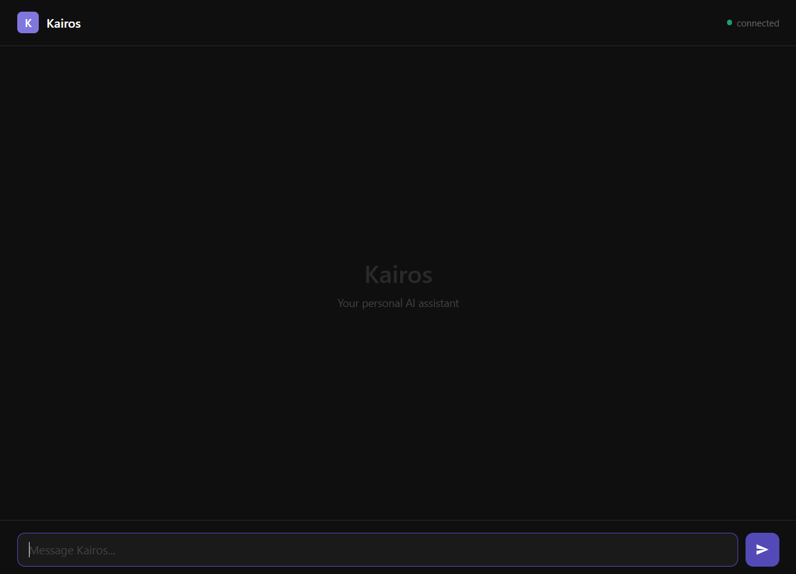

# User Guide

> Everything Kairos can do for you — features, use cases, and example prompts.

**← [Back to README](../README.md)** · [Architecture](ARCHITECTURE.md) · [Setup](SETUP.md) · [Contributing](CONTRIBUTING.md) · [Diagrams HTML](architecture.html) · [Diagrams PDF](kairos_architecture.pdf)

---

## Channels

### Telegram Bot
Your always-on interface. Works over mobile data, in noisy environments, or when you can't speak.

- **Authenticated** — locked to your numeric Telegram user ID
- **Typing indicator** — shows "typing..." while Kairos thinks
- **Long response splitting** — splits at paragraph boundaries, never mid-sentence
- **Proactive push** — morning briefings, reminders, and scheduled alerts land here

<p align="center">
  
</p>

### Web UI
Browser-based chat at `http://localhost:8000`.

- **Streaming** — tokens arrive as they're generated via WebSocket
- **Any device** — works from phone, tablet, or laptop on your LAN
- **Remote access** — use [Tailscale](https://tailscale.com) for secure access from anywhere

<p align="center">
  
</p>

### Voice *(coming soon)*
- Wake word → speak → hear the response
- Full pipeline: VAD → STT (Deepgram) → LLM → TTS (Cartesia) → speaker
- Designed for <500ms end-to-end on simple requests

---

## Features

### 📋 Task Management

Add, view, and complete tasks with priority and due dates.

```
"Add a task to finish the API integration by Friday"
"What tasks do I have?"
"What's my highest priority task?"
"Mark the deployment task as done"
"Add a high priority task: review PR #42"
```

Tasks are stored in SQLite with fields: title, due_date, status, project, priority.
When you ask about work or todos, open tasks are automatically injected into the prompt context.

<p align="center">
  
</p>

<p align="center">
  
</p>

---

### 📅 Calendar & Events

Manage your schedule with full event support.

```
"What do I have tomorrow?"
"Add a meeting with the team at 3pm on Thursday"
"What's my schedule for this week?"
"Any events coming up?"
```

Events include: title, start/end time, location, notes, and source (manual or synced).

---

### 🔥 Habit Tracking

Track daily habits with streak counting.

```
"Did I work out today?"
"Mark gym as done"
"How's my reading streak?"
"What habits am I tracking?"
"Mark DSA practice as done"
```

Each habit tracks: name, last completion date, current streak, and target frequency.

---

### 💰 Spending Tracker

Log expenses and view summaries by category.

```
"I spent 500 on groceries at BigBasket"
"How much have I spent on food this month?"
"Log 1200 for rent"
"What's my spending breakdown?"
```

Entries include: amount, category, merchant, date, and notes.

---

### 🔍 Web Search

Real-time web search with pluggable backends.

```
"What's the latest news on GPT-5?"
"Search for best laptops under 80k"
"What's the weather in Delhi?"
"Who won the match yesterday?"
```

Switch backends in `.env` — DuckDuckGo (free, default), Brave, Tavily, or Serper. See [Architecture → Tool System](ARCHITECTURE.md#tool-system) for details.

<p align="center">
  
</p>

---

### 🧠 Semantic Memory

Kairos remembers past conversations via vector embeddings.

```
"What did I say about the project last week?"
"Remember that I prefer dark mode"
"What was that restaurant name I mentioned?"
"What did we discuss about the API?"
```

Every conversation turn is embedded and stored. When relevant, past turns are retrieved via cosine similarity and injected into the prompt.

---

### ☀️ Morning Briefing

Automated daily push notification via Telegram.

- Summarises your open tasks and upcoming events
- Composed by the LLM — natural, concise, energetic
- Configurable time: `BRIEFING_HOUR` and `BRIEFING_MINUTE` in `.env`
- Timezone-aware (defaults to `Asia/Kolkata`)

---

### 💬 Conversation Continuity

Kairos maintains context within and across sessions.

- Last 8 turns included in every prompt
- Per-session history stored as JSON files
- Sessions auto-compact at 20 turns (configurable)
- Your profile and preferences are prepended to every single prompt

---

## Use Cases

### 🎓 Student / Learner
- Track DSA practice streaks and study habits
- Manage assignment deadlines with priority levels
- Morning briefings on what's due today
- Search for coding concepts, documentation, research papers
- Log daily study sessions as habits
- Track spending on courses and books

### 💼 Professional / Builder
- Manage project tasks across multiple repos
- Get reminded about meetings and deadlines
- Quick web search during deep work (without leaving your editor)
- Track spending on tools and infrastructure
- Voice commands while coding (hands-free, coming soon)

### 🏋️ Health & Routine
- Track gym sessions, diet, and meditation as habits
- Morning briefing includes routine reminders
- Streak tracking keeps you accountable
- Ask about your progress over time

### 🧠 Personal Knowledge
- Ask Kairos anything — it remembers past conversations
- Build a personal knowledge base through natural interaction
- Recall facts, decisions, and discussions from weeks ago
- "What did I decide about X?" actually works

### 📱 On-the-go
- Message your Telegram bot from anywhere
- Full task/event management from your phone
- Get proactive notifications even when away from your desk
- Works over mobile data — no need for Wi-Fi

---

## Tips

- **Keep `profile.md` under 2KB** — it's prepended to every prompt. Bloating it wastes tokens and slows down responses.
- **Use Telegram for quick tasks** — "add task: review PR" is faster than opening a browser.
- **Check your streaks daily** — "how are my habits?" gives you a quick accountability check.
- **Let the classifier do its job** — you don't need to specify complexity. Just ask naturally.
- **Morning briefings work best when you actually have tasks and events** — seed your database with real data.
